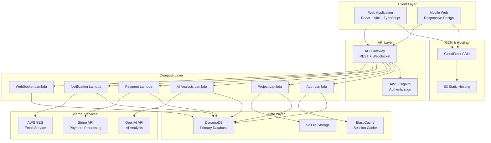
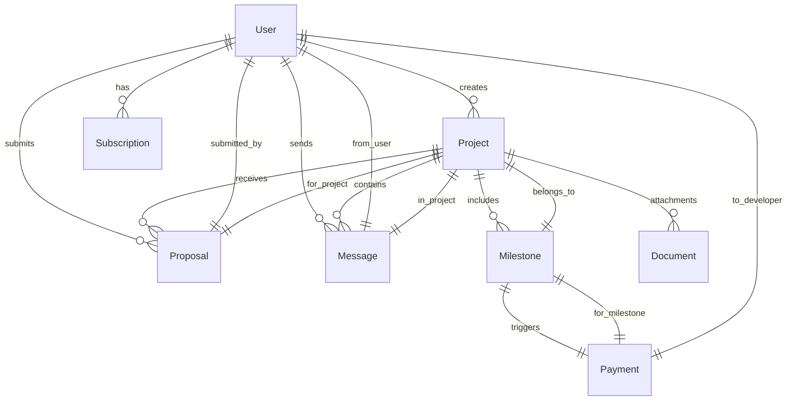

# ClarityBridge AI Marketplace - Technical Design Document

## Overview

ClarityBridge is a comprehensive AI-powered marketplace platform that bridges the gap between clients and developers through intelligent requirement analysis, scope change detection, and milestone-based project management. The platform leverages AWS Free Tier services to provide a cost-effective, scalable solution for freelance software development projects.

### Core Value Proposition

- **AI-Powered Requirement Analysis**: Converts client descriptions into structured, professional requirements
- **Intelligent Scope Detection**: Monitors project conversations for scope changes and suggests adjustments
- **Milestone-Based Payments**: Secure escrow system with automated payment processing
- **Real-Time Project Management**: Comprehensive tracking and notification system
- **AWS-Optimized Architecture**: Built entirely on AWS Free Tier with scalability options

### Key Technical Characteristics

- **Serverless Architecture**: Lambda functions with API Gateway for cost-effective scaling
- **Real-Time Capabilities**: WebSocket connections for live updates and notifications
- **AI Integration**: OpenAI API for requirement analysis and scope change detection
- **Security-First Design**: End-to-end encryption, secure authentication, and data privacy compliance
- **Performance Optimized**: Sub-3-second page loads with intelligent caching strategies

## Architecture

### High-Level System Architecture



### Service Architecture Patterns

**Microservices Pattern**: Each Lambda function represents a focused microservice handling specific business domains (authentication, projects, AI analysis, payments, notifications).

**Event-Driven Architecture**: Services communicate through DynamoDB Streams and EventBridge for loose coupling and scalability.

**CQRS Pattern**: Separate read and write operations with optimized data models for different query patterns using DynamoDB GSIs.

### Scalability Design

- **Horizontal Scaling**: Lambda functions automatically scale based on demand
- **Database Scaling**: DynamoDB on-demand billing with auto-scaling capabilities
- **CDN Optimization**: CloudFront for global content delivery and reduced origin load
- **Caching Strategy**: Multi-layer caching with ElastiCache and CloudFront edge caching

## Components and Interfaces

### Frontend Components

#### Core Application Structure
```typescript
// Main application architecture
src/
├── components/           # Reusable UI components
│   ├── auth/            # Authentication components
│   ├── projects/        # Project management components
│   ├── marketplace/     # Marketplace browsing components
│   ├── chat/           # Real-time messaging components
│   └── payments/       # Payment processing components
├── pages/              # Route-based page components
├── hooks/              # Custom React hooks
├── services/           # API service layer
├── store/              # State management (Zustand)
├── types/              # TypeScript type definitions
└── utils/              # Utility functions
```

#### Key Frontend Interfaces

**Authentication Interface**
```typescript
interface AuthService {
  login(email: string, password: string): Promise<AuthResult>
  register(userData: UserRegistration): Promise<AuthResult>
  logout(): Promise<void>
  getCurrentUser(): Promise<User | null>
  refreshToken(): Promise<string>
}
```

**Project Management Interface**
```typescript
interface ProjectService {
  createProject(description: string, documents?: File[]): Promise<Project>
  getProjects(filters: ProjectFilters): Promise<Project[]>
  getProject(id: string): Promise<Project>
  updateProject(id: string, updates: ProjectUpdate): Promise<Project>
  submitProposal(projectId: string, proposal: Proposal): Promise<void>
}
```

**Real-Time Communication Interface**
```typescript
interface WebSocketService {
  connect(userId: string): Promise<void>
  disconnect(): void
  sendMessage(projectId: string, message: string): Promise<void>
  onMessage(callback: (message: Message) => void): void
  onScopeChange(callback: (alert: ScopeChangeAlert) => void): void
}
```

### Backend Services

#### Authentication Service (Lambda)
```typescript
interface AuthenticationService {
  // User management
  registerUser(userData: UserRegistration): Promise<AuthResult>
  authenticateUser(credentials: LoginCredentials): Promise<AuthResult>
  refreshUserToken(refreshToken: string): Promise<TokenResult>
  
  // Profile management
  updateUserProfile(userId: string, profile: UserProfile): Promise<void>
  getUserProfile(userId: string): Promise<UserProfile>
  
  // Security features
  enableTwoFactor(userId: string): Promise<TwoFactorSetup>
  verifyTwoFactor(userId: string, code: string): Promise<boolean>
}
```

#### Project Management Service (Lambda)
```typescript
interface ProjectManagementService {
  // Project lifecycle
  createProject(clientId: string, projectData: ProjectCreation): Promise<Project>
  publishProject(projectId: string): Promise<void>
  updateProjectStatus(projectId: string, status: ProjectStatus): Promise<void>
  
  // Proposal management
  submitProposal(developerId: string, projectId: string, proposal: ProposalData): Promise<void>
  acceptProposal(clientId: string, proposalId: string): Promise<void>
  
  // Milestone management
  createMilestones(projectId: string, milestones: MilestoneData[]): Promise<void>
  updateMilestoneStatus(milestoneId: string, status: MilestoneStatus): Promise<void>
}
```

#### AI Analysis Service (Lambda)
```typescript
interface AIAnalysisService {
  // Requirement analysis
  analyzeRequirements(description: string, documents?: string[]): Promise<StructuredRequirements>
  
  // Scope change detection
  analyzeScopeChange(projectId: string, conversation: Message[]): Promise<ScopeChangeAnalysis>
  
  // Document processing
  processDocument(documentContent: string, projectContext: string): Promise<DocumentAnalysis>
}
```

#### Payment Processing Service (Lambda)
```typescript
interface PaymentService {
  // Escrow management
  createEscrowAccount(projectId: string, milestones: MilestonePayment[]): Promise<EscrowAccount>
  releaseMilestonePayment(milestoneId: string, clientApproval: boolean): Promise<PaymentResult>
  
  // Subscription management
  createSubscription(userId: string, plan: SubscriptionPlan): Promise<Subscription>
  updateSubscription(subscriptionId: string, changes: SubscriptionUpdate): Promise<void>
  
  // Commission processing
  calculateCommission(amount: number): Promise<CommissionBreakdown>
  processCommission(paymentId: string): Promise<void>
}
```

#### Notification Service (Lambda)
```typescript
interface NotificationService {
  // Email notifications
  sendEmail(recipient: string, template: EmailTemplate, data: any): Promise<void>
  
  // In-app notifications
  createNotification(userId: string, notification: NotificationData): Promise<void>
  markNotificationRead(notificationId: string): Promise<void>
  
  // Real-time alerts
  broadcastScopeChangeAlert(projectId: string, alert: ScopeChangeAlert): Promise<void>
  sendMilestoneReminder(milestoneId: string): Promise<void>
}
```

### External Service Integrations

#### OpenAI Integration
```typescript
interface OpenAIService {
  analyzeProjectDescription(description: string): Promise<RequirementAnalysis>
  detectScopeChanges(originalRequirements: string, conversation: string): Promise<ScopeChangeDetection>
  processDocuments(documents: DocumentContent[]): Promise<DocumentInsights>
}
```

#### AWS Service Integrations
```typescript
interface AWSServices {
  // Cognito integration
  cognito: {
    createUser(userData: CognitoUserData): Promise<CognitoUser>
    authenticateUser(credentials: AuthCredentials): Promise<CognitoAuthResult>
  }
  
  // S3 integration
  s3: {
    generatePresignedUrl(key: string, operation: 'get' | 'put'): Promise<string>
    uploadFile(key: string, file: Buffer): Promise<void>
  }
  
  // SES integration
  ses: {
    sendTemplatedEmail(template: string, recipient: string, data: any): Promise<void>
  }
}
```

## Data Models

### Core Entity Models

#### User Model
```typescript
interface User {
  userId: string              // Primary key
  email: string              // Unique identifier
  userType: 'client' | 'developer'
  profile: UserProfile
  subscription?: Subscription
  createdAt: string
  updatedAt: string
  
  // GSI keys for querying
  gsi1pk: string            // userType
  gsi1sk: string            // createdAt
}

interface UserProfile {
  firstName: string
  lastName: string
  avatar?: string
  bio?: string
  skills?: string[]         // For developers
  portfolio?: PortfolioItem[] // For developers
  preferences: UserPreferences
}
```

#### Project Model
```typescript
interface Project {
  projectId: string         // Primary key
  clientId: string         // Foreign key to User
  title: string
  description: string
  structuredRequirements: StructuredRequirements
  status: ProjectStatus
  budget: BudgetRange
  timeline: Timeline
  milestones: Milestone[]
  proposals: Proposal[]
  selectedDeveloperId?: string
  createdAt: string
  updatedAt: string
  
  // GSI keys for marketplace queries
  gsi1pk: string           // status
  gsi1sk: string           // createdAt
  gsi2pk: string           // budget range
  gsi2sk: string           // timeline
}

interface StructuredRequirements {
  userStories: UserStory[]
  acceptanceCriteria: AcceptanceCriteria[]
  technicalSpecs: TechnicalSpecification[]
  constraints: ProjectConstraint[]
}
```

#### Message Model
```typescript
interface Message {
  messageId: string         // Primary key
  projectId: string        // Sort key
  senderId: string
  content: string
  messageType: 'text' | 'file' | 'system'
  scopeChangeFlags?: ScopeChangeFlag[]
  timestamp: string
  
  // GSI for user message history
  gsi1pk: string           // senderId
  gsi1sk: string           // timestamp
}

interface ScopeChangeFlag {
  type: 'addition' | 'modification' | 'removal'
  confidence: number
  description: string
  suggestedAction: string
}
```

#### Proposal Model
```typescript
interface Proposal {
  proposalId: string        // Primary key
  projectId: string        // Foreign key
  developerId: string      // Foreign key
  timeline: number         // Days
  budget: number
  approach: string
  milestoneBreakdown: ProposalMilestone[]
  status: ProposalStatus
  submittedAt: string
  
  // GSI for project proposals
  gsi1pk: string           // projectId
  gsi1sk: string           // submittedAt
}
```

#### Milestone Model
```typescript
interface Milestone {
  milestoneId: string       // Primary key
  projectId: string        // Foreign key
  title: string
  description: string
  deliverables: string[]
  dueDate: string
  amount: number
  status: MilestoneStatus
  escrowStatus: EscrowStatus
  createdAt: string
  completedAt?: string
  
  // GSI for payment processing
  gsi1pk: string           // escrowStatus
  gsi1sk: string           // dueDate
}
```

### DynamoDB Table Design

#### Single Table Design Pattern
```typescript
// Primary table: ClarityBridge-Main
interface DynamoDBRecord {
  pk: string                // Partition key
  sk: string                // Sort key
  entityType: string        // Entity discriminator
  gsi1pk?: string          // GSI1 partition key
  gsi1sk?: string          // GSI1 sort key
  gsi2pk?: string          // GSI2 partition key
  gsi2sk?: string          // GSI2 sort key
  data: any                // Entity-specific data
  ttl?: number             // TTL for temporary records
}

// Access patterns:
// 1. Get user by ID: pk=USER#{userId}, sk=PROFILE
// 2. Get user projects: pk=USER#{userId}, sk begins_with PROJECT#
// 3. Get marketplace projects: gsi1pk=PROJECT#PUBLISHED, gsi1sk=timestamp
// 4. Get project messages: pk=PROJECT#{projectId}, sk begins_with MESSAGE#
// 5. Get developer proposals: gsi1pk=DEVELOPER#{developerId}, sk begins_with PROPOSAL#
```

### Data Relationships



### Data Consistency and Integrity

**Eventual Consistency Strategy**: DynamoDB's eventually consistent reads are acceptable for most use cases, with strongly consistent reads used only for critical operations like payment processing.

**Data Validation**: All data models include comprehensive validation schemas using Joi or similar libraries to ensure data integrity at the application layer.

**Audit Trail**: All critical operations (payments, project status changes, scope modifications) maintain audit logs with timestamps and user attribution.

## Correctness Properties

*A property is a characteristic or behavior that should hold true across all valid executions of a system-essentially, a formal statement about what the system should do. Properties serve as the bridge between human-readable specifications and machine-verifiable correctness guarantees.*

### Property 1: AI Analysis Performance and Completeness

*For any* client project description, the AI analysis should complete within 30 seconds and generate output containing user stories, acceptance criteria, milestones, and technical specifications.

**Validates: Requirements 1.1, 1.2**

### Property 2: Document Integration Round Trip

*For any* project with uploaded documents, the document content should be extractable, analyzable, and incorporated into the final structured requirements within 60 seconds.

**Validates: Requirements 1.5, 6.2, 6.3, 6.4**

### Property 3: User Story Format Validation

*For any* generated requirements, all user stories should follow the proper format: "As a [user type], I want [goal], so that [benefit]".

**Validates: Requirements 1.6**

### Property 4: Project Publication Performance

*For any* approved project requirements, publication to the marketplace should complete within 5 seconds and make the project visible to all developers.

**Validates: Requirements 1.7, 2.1**

### Property 5: Project Detail Completeness

*For any* published project, the detail view should contain structured requirements, milestones, budget range, and timeline information.

**Validates: Requirements 2.2**

### Property 6: Marketplace Filtering Functionality

*For any* combination of filter criteria (technology, budget, timeline, complexity), the marketplace should return only projects matching all specified filters.

**Validates: Requirements 2.3**

### Property 7: Proposal Submission Completeness

*For any* developer proposal submission, the system should capture and store timeline, budget, and approach details.

**Validates: Requirements 2.4**

### Property 8: Notification Timing Requirements

*For any* critical system event (new proposals, scope changes, milestone deadlines, security incidents), notifications should be delivered within the specified timeframes: proposals (15 minutes), scope changes (2 minutes), deadlines (48 hours advance), security incidents (72 hours).

**Validates: Requirements 2.5, 3.2, 7.4, 11.8**

### Property 9: Featured Developer Prominence

*For any* developer with featured listing subscription, their proposals should appear prominently compared to non-featured developers in the same project.

**Validates: Requirements 2.6**

### Property 10: Scope Change Detection and Classification

*For any* project conversation, the scope detector should analyze all messages and correctly classify detected changes as additions, modifications, or removals from original requirements.

**Validates: Requirements 3.1, 3.3**

### Property 11: Scope Change Workflow Completeness

*For any* detected scope change, the system should generate alerts with suggested milestone adjustments and require mutual agreement before implementation.

**Validates: Requirements 3.4, 3.5**

### Property 12: Scope Change Audit Trail

*For any* project with scope changes, the system should maintain a complete log of discussions and resolutions, and update project parameters when changes are approved.

**Validates: Requirements 3.6, 3.7**

### Property 13: Escrow Account Creation

*For any* project initiation, the payment processor should create escrow accounts for each defined milestone.

**Validates: Requirements 4.1**

### Property 14: Commission Calculation Consistency

*For any* milestone payment, the platform should collect exactly 5% commission and generate proper payment receipts and tax documentation.

**Validates: Requirements 4.2, 4.8**

### Property 15: Payment Timeline Enforcement

*For any* milestone completion, clients should have exactly 7 days to review, with automatic payment release if no response is received, and funds transferred to developers within 24 hours of approval.

**Validates: Requirements 4.4, 4.5, 4.7**

### Property 16: Dispute Payment Holding

*For any* milestone in dispute status, the payment processor should hold funds until resolution is achieved.

**Validates: Requirements 4.6**

### Property 17: Authentication Method Support

*For any* user registration or login attempt, the system should support both email/password and social login authentication methods.

**Validates: Requirements 5.1**

### Property 18: Email Verification Workflow

*For any* new user registration, the system should require email verification before account activation.

**Validates: Requirements 5.2**

### Property 19: User Profile Type Differentiation

*For any* user account, the system should maintain distinct profile types (client or developer) with appropriate fields and capabilities for each type.

**Validates: Requirements 5.3**

### Property 20: Password Security Requirements

*For any* password creation or update, the system should enforce strong password requirements: minimum 8 characters with mixed case, numbers, and symbols.

**Validates: Requirements 5.4**

### Property 21: Security Feature Availability

*For any* user account, the system should provide password reset functionality, profile update capabilities, two-factor authentication options, and account locking for suspicious activity.

**Validates: Requirements 5.5, 5.6, 5.7, 5.8**

### Property 22: File Upload Validation

*For any* document upload attempt, the system should accept only PDF, DOC, DOCX, and TXT files up to 10MB in size.

**Validates: Requirements 6.1**

### Property 23: Document Security and Versioning

*For any* uploaded document, the system should store it securely with proper access controls, redact personal data when detected, and maintain version history.

**Validates: Requirements 6.5, 6.6, 6.7**

### Property 24: Real-Time Progress Updates

*For any* milestone status change, the system should immediately update progress indicators and dashboards for both clients and developers.

**Validates: Requirements 7.1, 7.2**

### Property 25: Time Tracking and Comparison

*For any* active project, the system should display time remaining for milestones, track time spent on tasks, and compare against estimates.

**Validates: Requirements 7.3, 7.5**

### Property 26: Schedule Management

*For any* project falling behind schedule, the system should suggest timeline adjustments and generate status reports for stakeholder review.

**Validates: Requirements 7.6, 7.7**

### Property 27: Subscription Tier Enforcement

*For any* user account, the system should enforce appropriate limits: free tier (3 projects, 500-word descriptions), Pro Client (unlimited projects at Rs. 499/month), Developer Featured (Rs. 299/month).

**Validates: Requirements 8.1, 8.2, 8.4**

### Property 28: Subscription Lifecycle Management

*For any* subscription, the system should handle automatic recurring billing, prompt for upgrades when limits are exceeded, gracefully downgrade expired subscriptions, and provide usage analytics and billing history.

**Validates: Requirements 8.3, 8.5, 8.6, 8.7**

### Property 29: Notification System Completeness

*For any* user, the system should provide both email and in-app notifications, allow customization of preferences by event type, queue notifications for offline users, and maintain notification history.

**Validates: Requirements 9.2, 9.4, 9.5, 9.7**

### Property 30: AWS Infrastructure Integration

*For any* system component, the platform should properly integrate with AWS services: S3/CloudFront for hosting, API Gateway/Lambda for backend, DynamoDB with GSI for data, Cognito for auth, and SES for email.

**Validates: Requirements 10.1, 10.2, 10.3, 10.4, 10.6**

### Property 31: Secure File Access

*For any* file storage operation, the system should use S3 with pre-signed URLs for secure access.

**Validates: Requirements 10.5**

### Property 32: AWS Usage Monitoring

*For any* AWS service usage, the system should monitor consumption to stay within Free Tier limits and alert administrators when limits are approached.

**Validates: Requirements 10.7, 10.8**

### Property 33: Data Encryption and Security

*For any* data transmission or storage, the system should use TLS 1.2+ for transit encryption and AES-256 for rest encryption, implement proper access controls, and comply with PCI DSS and GDPR requirements.

**Validates: Requirements 11.1, 11.2, 11.3, 11.4, 11.5**

### Property 34: Privacy Rights Implementation

*For any* user data, the system should provide export and deletion capabilities to support privacy rights.

**Validates: Requirements 11.6**

### Property 35: Security Monitoring and Logging

*For any* security event, the system should log the event and monitor for suspicious activities.

**Validates: Requirements 11.7**

### Property 36: Performance Requirements

*For any* user interaction, the system should load pages within 3 seconds, respond to API calls within 2 seconds for 95% of requests, and maintain 99.5% uptime availability.

**Validates: Requirements 12.1, 12.2, 12.3**

### Property 37: System Resilience

*For any* system error or service unavailability, the platform should provide meaningful error messages, implement graceful degradation, and use caching to improve response times.

**Validates: Requirements 12.5, 12.6, 12.7**

### Property 38: Concurrent User Handling

*For any* number of concurrent users up to Free Tier service limits, the system should maintain proper functionality and performance.

**Validates: Requirements 12.4**

### Property 39: Maintenance Communication

*For any* required maintenance, the system should notify users 24 hours in advance.

**Validates: Requirements 12.8**

## Error Handling

### Error Classification Strategy

**Client Errors (4xx)**
- **400 Bad Request**: Invalid input data, malformed requests, validation failures
- **401 Unauthorized**: Authentication failures, expired tokens
- **403 Forbidden**: Authorization failures, insufficient permissions
- **404 Not Found**: Resource not found, invalid endpoints
- **409 Conflict**: Duplicate resources, concurrent modification conflicts
- **429 Too Many Requests**: Rate limiting, quota exceeded

**Server Errors (5xx)**
- **500 Internal Server Error**: Unhandled application errors, database failures
- **502 Bad Gateway**: External service failures (OpenAI API, Stripe API)
- **503 Service Unavailable**: Temporary service outages, maintenance mode
- **504 Gateway Timeout**: External service timeouts, long-running operations

### Error Handling Patterns

#### Circuit Breaker Pattern
```typescript
interface CircuitBreaker {
  execute<T>(operation: () => Promise<T>): Promise<T>
  getState(): 'CLOSED' | 'OPEN' | 'HALF_OPEN'
  onFailure(error: Error): void
  onSuccess(): void
}

// Implementation for external service calls
const openAICircuitBreaker = new CircuitBreaker({
  failureThreshold: 5,
  recoveryTimeout: 30000,
  monitoringPeriod: 60000
})
```

#### Retry Logic with Exponential Backoff
```typescript
interface RetryConfig {
  maxAttempts: number
  baseDelay: number
  maxDelay: number
  backoffMultiplier: number
  retryableErrors: string[]
}

const defaultRetryConfig: RetryConfig = {
  maxAttempts: 3,
  baseDelay: 1000,
  maxDelay: 10000,
  backoffMultiplier: 2,
  retryableErrors: ['NETWORK_ERROR', 'TIMEOUT', 'SERVICE_UNAVAILABLE']
}
```

#### Graceful Degradation Strategies

**AI Service Degradation**
- Primary: OpenAI API for requirement analysis
- Fallback: Template-based requirement generation
- Emergency: Manual requirement entry with guided forms

**Payment Service Degradation**
- Primary: Stripe API for payment processing
- Fallback: Manual payment tracking with email notifications
- Emergency: Offline payment coordination

**Notification Service Degradation**
- Primary: AWS SES for email notifications
- Fallback: In-app notification queue
- Emergency: Manual notification via platform messaging

### Error Recovery Mechanisms

#### Database Error Recovery
```typescript
interface DatabaseErrorHandler {
  handleConnectionError(): Promise<void>
  handleThrottlingError(retryAfter: number): Promise<void>
  handleValidationError(error: ValidationError): ErrorResponse
  handleConditionalCheckFailure(): Promise<void>
}
```

#### File Upload Error Recovery
```typescript
interface FileUploadErrorHandler {
  handleSizeExceededError(fileSize: number, maxSize: number): ErrorResponse
  handleUnsupportedFormatError(format: string): ErrorResponse
  handleUploadTimeoutError(): Promise<void>
  handleVirusScanFailure(): ErrorResponse
}
```

#### Real-Time Communication Error Recovery
```typescript
interface WebSocketErrorHandler {
  handleConnectionLoss(): Promise<void>
  handleMessageDeliveryFailure(message: Message): Promise<void>
  handleScopeDetectionFailure(projectId: string): Promise<void>
}
```

### Error Monitoring and Alerting

**Critical Error Alerts**
- Payment processing failures
- Security breach attempts
- Data corruption incidents
- Service outages exceeding 5 minutes

**Warning Level Alerts**
- High error rates (>5% of requests)
- Performance degradation (>3 second response times)
- External service failures
- AWS Free Tier limit approaches

**Monitoring Metrics**
- Error rate by service and endpoint
- Response time percentiles (50th, 95th, 99th)
- Success rate for critical operations
- External service dependency health

## Testing Strategy

### Dual Testing Approach

The ClarityBridge platform requires comprehensive testing coverage through both unit tests and property-based tests to ensure correctness, reliability, and performance.

#### Unit Testing Strategy

**Focus Areas for Unit Tests**
- **Specific Examples**: Test concrete scenarios with known inputs and expected outputs
- **Edge Cases**: Test boundary conditions, empty inputs, maximum limits
- **Error Conditions**: Test error handling, validation failures, exception scenarios
- **Integration Points**: Test service boundaries, API contracts, data transformations

**Unit Test Categories**

1. **Component Tests**: Individual React components with mock dependencies
2. **Service Tests**: Business logic services with mocked external dependencies  
3. **Integration Tests**: End-to-end workflows with real AWS services in test environment
4. **API Tests**: REST and WebSocket endpoint testing with various payloads

**Example Unit Tests**
```typescript
// Authentication service unit tests
describe('AuthenticationService', () => {
  it('should reject passwords shorter than 8 characters', async () => {
    const result = await authService.validatePassword('short')
    expect(result.isValid).toBe(false)
    expect(result.errors).toContain('Password must be at least 8 characters')
  })
  
  it('should successfully authenticate valid credentials', async () => {
    const credentials = { email: 'test@example.com', password: 'ValidPass123!' }
    const result = await authService.authenticate(credentials)
    expect(result.success).toBe(true)
    expect(result.token).toBeDefined()
  })
})
```

#### Property-Based Testing Strategy

**Property-Based Testing Library**: fast-check for TypeScript/JavaScript
**Configuration**: Minimum 100 iterations per property test
**Test Tagging**: Each property test references its design document property

**Property Test Categories**

1. **Performance Properties**: Timing requirements, response time limits
2. **Data Integrity Properties**: Round-trip serialization, data consistency
3. **Business Logic Properties**: Commission calculations, milestone workflows
4. **Security Properties**: Access control, data encryption, input validation
5. **Integration Properties**: External service interactions, error handling

**Example Property Tests**
```typescript
import fc from 'fast-check'

// Feature: claritybridge-ai-marketplace, Property 14: Commission Calculation Consistency
describe('Commission Calculation Properties', () => {
  it('should always calculate exactly 5% commission for any payment amount', () => {
    fc.assert(fc.property(
      fc.float({ min: 0.01, max: 10000 }), // Payment amounts
      (paymentAmount) => {
        const commission = calculateCommission(paymentAmount)
        const expectedCommission = paymentAmount * 0.05
        expect(commission).toBeCloseTo(expectedCommission, 2)
      }
    ), { numRuns: 100 })
  })
})

// Feature: claritybridge-ai-marketplace, Property 2: Document Integration Round Trip  
describe('Document Processing Properties', () => {
  it('should process any valid document within 60 seconds', () => {
    fc.assert(fc.property(
      fc.record({
        content: fc.string({ minLength: 1, maxLength: 10000 }),
        format: fc.constantFrom('pdf', 'doc', 'docx', 'txt'),
        size: fc.integer({ min: 1, max: 10 * 1024 * 1024 }) // Up to 10MB
      }),
      async (document) => {
        const startTime = Date.now()
        const result = await documentAnalyzer.process(document)
        const processingTime = Date.now() - startTime
        
        expect(processingTime).toBeLessThan(60000) // 60 seconds
        expect(result.extractedContent).toBeDefined()
        expect(result.requirements).toBeDefined()
      }
    ), { numRuns: 100 })
  })
})
```

#### Test Environment Strategy

**Local Development Testing**
- Unit tests with mocked AWS services using aws-sdk-mock
- Property tests with generated test data
- Component tests with React Testing Library
- Integration tests with LocalStack for AWS services

**CI/CD Testing Pipeline**
- Automated unit and property test execution on every commit
- Integration tests in dedicated AWS test environment
- Performance tests with load testing tools
- Security tests with OWASP ZAP and dependency scanning

**Production Testing**
- Synthetic monitoring with CloudWatch Synthetics
- Real user monitoring with performance metrics
- A/B testing for feature rollouts
- Chaos engineering for resilience testing

#### Test Data Management

**Generated Test Data**
- Property-based tests use fast-check generators for comprehensive input coverage
- Realistic user profiles, project descriptions, and conversation data
- Edge cases: empty inputs, maximum sizes, special characters, malformed data

**Test Data Isolation**
- Separate DynamoDB tables for test environments
- Isolated S3 buckets for test file uploads
- Test-specific Cognito user pools
- Mock external services (OpenAI, Stripe) for predictable testing

#### Coverage Requirements

**Code Coverage Targets**
- Unit tests: 80% line coverage minimum
- Property tests: 100% coverage of correctness properties
- Integration tests: 90% coverage of critical user journeys
- End-to-end tests: 100% coverage of core business workflows

**Quality Gates**
- All tests must pass before deployment
- Performance tests must meet SLA requirements
- Security tests must pass vulnerability scans
- Property tests must complete all iterations successfully

This comprehensive testing strategy ensures that the ClarityBridge platform maintains high quality, reliability, and correctness across all features and user interactions.